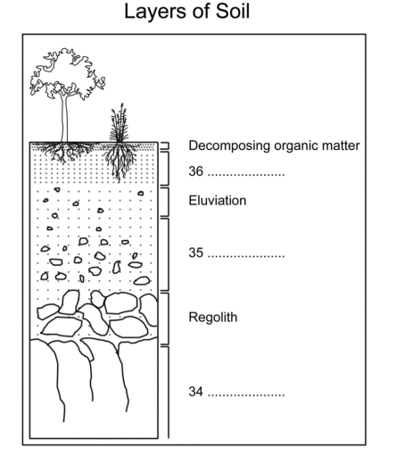

# IELTS Materials

*Click  if you like the project. Pull Request are highly appreciated.*

## Table of Contents

IELTS (**I**maginative **E**xcellent **L**aid-back **T**uned-in **S**mart)

* *[Listening](listening.md)*
* *[Reading](reading.md)*
* *[Writing](Writing.md)*
* *[Speaking](Speaking.md)*
* *[Vocabulary](Vocabulary.md)*

 

## IELTS LISTENING

 

## # ***Importance of Soil in an Organic Agriculture***

If soil is healthy, it is a living entity teeming with life such as worms, fungi and bacteria. If plants are grown in poor soil, they will lack nutrients and human health will suffer. Plants are nourished by organic matter, minerals and other essential elements which are broken down by insects and other organisms in a synergistic relationship.

  

**Layers of Solis**

* Decomposing Organic Matter
* Topsoil
* Eluviation
* Subsoil
* Regolith
* Bedrock

**Farming Methods**

|Conventional               | Organic                     |
|---------------------------|-----------------------------|
| Monoculture               | Crop Rotation |
| Synthetic fertilizers and chemicals used for pest control | Covering crops |
| Genetically modified seeds | Use of insects as natural Predators
| Pesticide and fungicide sprayed on crop after picking | Addition of manure and green waste
| No need for documentation of production practices| |

    <b><a href="#">↥ back to top</a></b>

## # ***Types of Teeth***

1. **Incisors:-** Incisors are the eight teeth in the front and center of your mouth. These are the teeth that use to take bites of food.

1. **Canines:-** These are your sharpest teeth and used for ripping and tearing food apart.

1. **Premolars:-** Premolars or bicuspids are used for chewing and grinding food.

1. **Molars:-** Primary molars are also used for chewing and grinding food.

1. **Third Molars:-** Third molars are commonly known as wisdom teeth.

    <b><a href="#">↥ back to top</a></b>

## GRAMMARS

 

## # ***Collocation***

Collocation refers to how words go together or from fixed relationship.

**Typical Collocations**

- Heavy rain
- High temperature
- Scenic view
- Have an experience

**Example**

* She has blonde hair.
* She was discharged from hospital.
* She was released from hospital. [**Incorrect**]

**Strong Collocation**

- Whisk an egg
- Curly hair
- Winding road
- Blissfully ignorant
- The fast train
- Fast food
- A quick shower
- a quick meal

**Types of collocation**

There are several different types of collocation made from combinations of verb, noun, adjective etc. Some of the most common types are:

| Combination       |  Example                 | not to use          | 
|-------------------|--------------------------|---------------------|
|adverb + adjective | completely satisfied     |(NOT downright satisfied)|
|adjective + noun   | excruciating pain        |(NOT excruciating joy)|
|noun + noun        | a surge of anger         | (NOT a rush of anger)|
|noun + verb        | lions roar               |(NOT lions shout)|
|verb + noun        | commit suicide           |(NOT undertake suicide)|
|verb + expression with preposition | burst into tears |(NOT blow up in tears)|
|verb + adverb      | wave frantically         |(NOT wave feverishly)|

**Sample Collocations**

There are several different types of collocation. Collocations can be adjective + adverb, noun + noun, verb + noun and so on.

**1. adverb + adjective**

* Invading that country was an **utterly stupid** thing to do.
* We entered a **richly decorated** room.
* Are you **fully aware** of the implications of your action?

**2. adjective + noun**

* The doctor ordered him to take **regular exercise**.
* The Titanic sank on its **maiden voyage**.
* He was writhing on the ground in **excruciating pain**.

**3. noun + noun**

* Let\'s give Mr Jones a **round of applause**.
* The **ceasefire agreement** came into effect at 11am.
* I'd like to buy two **bars of soap** please.

**4. noun + verb**

* The **lion** started **to roar** when it heard the **dog barking**.
* **Snow was falling** as our **plane took off**.
* The **bomb went off** when he started the car engine.

**5. verb + noun**

* The prisoner was hanged for **committing murder**.
* I always try to **do my homework** in the morning, after **making my bed**.
* He has been asked to **give a presentation** about his work.

**6. verb + expression with preposition**

* We had to return home because we **had run out of money**.
* At first her eyes **filled with horror**, and then she **burst into tears**.
* Their behavior was enough to **drive anybody to crime**.

**7. verb + adverb**

* She **placed** her keys **gently** on the table and sat down.
* Mary **whispered softly** in John\'s ear.
* I **vaguely remember** that it was growing dark when we left.

## Q. ***The graph below shows the proportion of four different materials that were recycled from 1982 to 2010 in a particular country. Summarize the information by selecting and reporting the main features and make comparison where relevant.***

  

The given line graph shows the recycling rate for four different materials during the period from 1982 to 2010 in a particular country. It is evident that paper & cardboard is the most recycled material. About 65 percent of paper & cardboard was recycled in 1982. The recycling of these materials reached their peak value of 80 percent in 1994. From then onwards, there was a steady decline in the amount of paper & cardboard recycled.

Glass containers are the second most recycled material. While in 1982 about 50% of glass containers were recycled, that figure rose to 60% in 2010. The recycling of aluminum cans started in 1984. While only about 5 percent of aluminum cans were recycled in that year that figure rose steadily to 45 percent in 2010.

Plastic is the least recycled material. The recycling of plastic started around 1988. However, there has only been a small increase in the amount of plastic recycled over the years.

## Q. ***Learning English at school is often seen as more important than learning local languages. If these are not taught, many are at risk of dying out. In your opinion, is it important for everyone to learn English? Should we try to ensure the survival of local languages and, if so, how?***

Over the recent years, globalization has led to the free exchange of ideas and cultures. This inturn led to an extensive use of english as a **lingua franca**. In todays world learning this language is mandatory to succeed in life. At the same time local languages have to be preserved.

To begin with, the usage of as a bridge language desirable as it enhances cross cultural communication. These days job opportunities are various for people who are proficient in this language as this is the language of business. Most of the multinational companies open their branches across the world and mostly people who are well versed with english language are provided with high paid job. Apart from that if a country is to become competent in any field it is imperative for it to learn english. Succeeding in life is seldom seen without this.

Furthermore, it embodies a clear accessible standard for everybody to follow be it in books, movies or the internet. Most of the books, movies and magazines published in the world are in english. This is the language of technology, science, medicine, industry and education.

However, the decreased use of local language would lead to its death and language death means loss of culture. Culture forms language and language resolves around culture, the of one means the same for the other. Government must take appropriate action to protect their language from **extinction**. Appropriate legislation should be made and government must provide **adequate** funds for local language training institutions. Additionally individuals should continue using their mother langue.

To conclude, while proficiency in english is a much needed aspect to lead a successful life, one should also take pride in learning their local languages which is mandatory for the survival of these languages.

|Words used    | Meaning                              |
|--------------|--------------------------------------|
|lingua franca |A common language used by speakers of different languages |
|competent     | (of a person) efficient and capable. |
|imperative    | of vital importance; crucial.        |
|seldom        | rarely                               |

## IELTS TASK 2: WRITING SECTION - TIPS

 

**1. TASK ACHIEVEMENT: 9.0**

* Answer all parts of the question
* Present relevant ideas
* Fully explain these ideas
* Support ideas with relevant, specific examples
* Word Count

**2. COHERENCE AND COHESION: 9.0**

* Structure your answers in logical paragraphs
* One main idea per paragraph
* Include an introduction and conclusion
* Support main points with an explanation and then an example
* Use cohesive linking words accurately and appropriately
* Vary your linking phrases using synonyms

**3. LEXICAL RESOURCE: 9.0**

* Try to vary your vocabulary using accurate synonyms
* Use less common question specific words that accurately convey meaning
* Check your work for spelling and word formation mistakes

**4. GRAMMATICAL RANGE: 9.0**

* Use a variety of complex and simple sentences
* Check your writing for errors

## Q. ***Some people think that having a set retirement age (e.g. 65 years) for everybody, regardless of occupation is unfair. They believe that certain workers deserve to retire and receive a pension at an earlier age. Do you agree or disagree? Which type of workers do you think should benefit from early retirement?***

Since the inception of human civilization, the debate over the retirement age is widespread. Although people usually continue working after retirement in most countries retirement is regulated. Some countries with huge youth workforce, allow their citizens to retire early as 50. Similarly countries that struggle with lack of workforce allow people to work more than 60 as 65 or 70 too. However there are few occupations which demand exceptions over age limits. For example: in politics, people work with no age limit as this occupation is paramount and requires significantly long and skilled experience and in the military servicemen are allowed to actively serve till 45 years only as the necessitates impeccable physical fitness and dynamic adaptability.

Firstly, countries with huge youth workforce have enacted rules to force an average workers to end their carreras early at an age of 50. Eminently, thi decision is influenced by the requirement to engage maximum workforce to employment. Moreover youth bring extra energy and new innovative ideas to turn job more productive and less costly. However, even in these countries we find retried people working as freelancers after retirement as early retirement for most is not a rewarding experience and in most cases, early retirement doesn\'t suffice all monetary requirement. For example: officially china, a country with the largest youth and overall population doesn\'t allow its citizens to work after 50.

Secondly, some countries like Poland Iceland ect allow their citizens to work till 70 as these countries are enduring with low workforce and high ageing people who hold a major share of he population. Obviously, this has some repercussions over the productivity. But many people support this idea as this allows them to mustering money and resources to spend happy and independent life afterwards. For example, Austria a country with the highest share of senior citizens allow people to work till 70 and in order to tackle the issue, the country has announced a  skilled migration scheme to attract killed workers from other countries.

In conclusion, I believe that a retirement age should be selected after intensive research into a country jb markets, population ratio and other factors impacting society. Also, certain occupations must be vetted differently as they require some specific skills. For example, politician must not be barred after any age ans similarly serviceman must get retirement after 50. Two types of workers would benefits from early retirement. First are the those who work tough, physically demanding conditions such as constructions workers, coal miners and welders. The other are workers in high stress positions where sound judgement is crucial for public safety. Emergency medical practitioners and air traffic control operators are two such examples. With people working lives differing on an individual basis., it is difficult to classify them into large groups and distributes pensions accordingly. Nevertheless, many individuals still deserve an early pension and in some cases our well-being may depend on giving it to them.

    <b><a href="#">↥ back to top</a></b>

